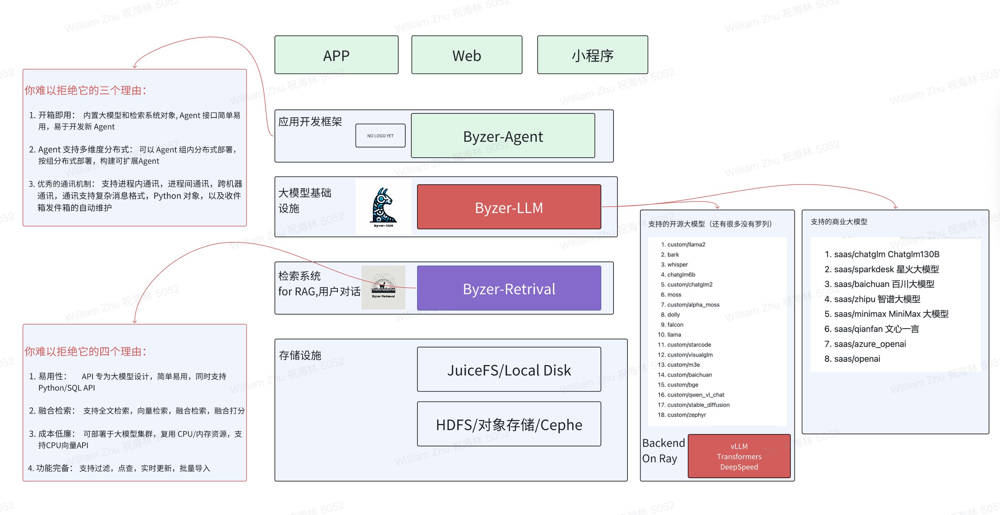
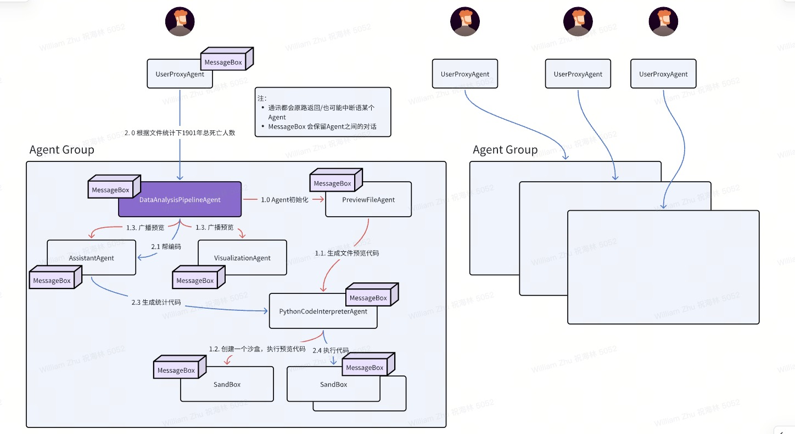

<p align="center">
   <picture>    
    
  </picture>
</p>

<h3 align="center">
Easy, fast, and distributed agent framework for everyone
</h3>

<p align="center">
| <a href="#"><b>Documentation</b></a> | <a href="#"><b>Blog</b></a> | | <a href="#"><b>Discord</b></a> |

</p>

---

*Latest News* 🔥

- [2023/12] Byzer-Agent released in Byzer-LLM 0.1.20

---

Byzer-Agent is an agent framework for LLM. It is designed to be easy to use, easy to scale, and easy to debug. It is built on top of Ray, a high-performance distributed execution framework.

The code of Byzer-Agent is under the project [Byzer-LLM](https://github.com/allwefantasy/byzer-llm). So this project is just a document project.

---

---

* [Architecture](#Architecture)
* [DataAnalysis (multi-agent)](#DataAnalysis-(multi-agent))
* [RAG Example](#rag-example)
* [DataAnalysis](#DataAnalysis)
* [Custom Agent](#custom-agent)
* [Remote Agent](#remote-agent)

## Architecture

<p align="center">
  
</p>

---

## DataAnalysis (multi-agent)

<p align="center">
  
</p>

---

## RAG Example

Please install the following projects first:

1. [Byzer-LLM](https://github.com/allwefantasy/byzer-llm), 
2. [Byzer-Retrieval](https://github.com/allwefantasy/byzer-retrieval)


Here is the example code:

```python
user.initiate_chat(
retrieval_agent,
message={
    "content":"介绍下 Gluten",
    "metadata":{
        "file_path":"/home/byzerllm/projects/jupyter-workspace/aritcle.txt"
    }
},)

```

The output:

```
user (to retrieval_agent):

介绍下 Gluten

--------------------------------------------------------------------------------
retrieval_agent (to user):

 Gluten 是一个开源项目，其目标是通过本地化 Spark 项目，以提高 Spark 在 ETL 批处理领域的性能。Gluten 项目由深耕于 Spark 加速的 Intel OAP 团队和 Kyligence 公司共建，BIGO 大数据团队于 2022 年 9 月加入研发。Gluten 项目的核心思想是使用本地的 Native 运行时库作为 Spark 插件，结合了 Spark 的可扩展性框架、优化器、容错能力和 Native 执行库的高性能，预期可以带来数倍的性能提升。

Gluten 项目主要支持 Velox 和 ClickHouse 两种 Native 执行库。Velox 是 Meta 开源的本地执行库，其目标是构建统一的查询执行层，提供了数据类型、向量数据结构、Pipeline 框架、算子、表达式计算、IO 和资源管理等功能。而 ClickHouse 是 2016 年 Yandex 公司开源的一种用于联机分析(OLAP)的列式数据库，以其高性能近年来备受关注。

BIGO 大数据团队在 2022 年 9 月加入 Gluten 项目后，已经在生产环境逐步灰度 Gluten，开始替换 Spark 的 ETL 工作负载，目前灰度 SQL 上获得了总体 40%+ 的成本节省。

```

The code of this example is [here](./notebooks/quick_rag.ipynb).

---

## DataAnalysis

* Connect to Ray Cluster

```python
code_search_path=["/home/byzerllm/softwares/byzer-retrieval-lib/"]
env_vars = {"JAVA_HOME": "/home/byzerllm/softwares/jdk-21",
            "PATH":"/home/byzerllm/softwares/jdk-21/bin:/home/byzerllm/.rvm/gems/ruby-3.2.2/bin:/home/byzerllm/.rvm/gems/ruby-3.2.2@global/bin:/home/byzerllm/.rvm/rubies/ruby-3.2.2/bin:/home/byzerllm/.rbenv/shims:/home/byzerllm/.rbenv/bin:/home/byzerllm/softwares/byzer-lang-all-in-one-linux-amd64-3.3.0-2.3.7/jdk8/bin:/usr/local/cuda/bin:/usr/local/cuda/bin:/home/byzerllm/.rbenv/shims:/home/byzerllm/.rbenv/bin:/home/byzerllm/miniconda3/envs/byzerllm-dev/bin:/home/byzerllm/miniconda3/condabin:/home/byzerllm/.local/bin:/home/byzerllm/bin:/usr/local/cuda/bin:/usr/local/bin:/usr/bin:/usr/local/sbin:/usr/sbin:/home/byzerllm/.rvm/bin:/home/byzerllm/.rvm/bin"}

import os
os.environ["RAY_DEDUP_LOGS"] = "0" 

import ray
from byzerllm.utils.retrieval import ByzerRetrieval
from byzerllm.utils.client import ByzerLLM,LLMRequest,LLMResponse,LLMHistoryItem,InferBackend
from byzerllm.records import SearchQuery

ray.init(address="auto",namespace="default",
                 job_config=ray.job_config.JobConfig(code_search_path=code_search_path,
                                                      runtime_env={"env_vars": env_vars})
                 )   

retrieval = ByzerRetrieval()
retrieval.launch_gateway()

llm = ByzerLLM()
chat_model_name = "chat"

if not llm.is_model_exist("chat"):
    llm.setup_gpus_per_worker(2).setup_num_workers(1).setup_infer_backend(InferBackend.VLLM)
    llm.deploy(
        model_path="/home/byzerllm/models/openbuddy-zephyr-7b-v14.1",
        pretrained_model_type="custom/auto",
        udf_name=chat_model_name,
        infer_params={"backend.max_num_batched_tokens":32768}
    )

llm.setup_default_model_name(chat_model_name)  

def show_code(lang,code_string):
    from IPython.display import display, Markdown    
    display(Markdown("```{}\n{}\n```".format(lang,code_string)))


def show_text(msg):
    from IPython.display import display, Markdown
    display(Markdown("```{}\n{}\n```".format("text",msg))) 

def show_image(content):
    from IPython.display import display, Image
    import base64             
    img = Image(base64.b64decode(content))
    display(img)    
    
```

* Create a DataAnalysis agent group


```python
from byzerllm.apps.agent import Agents
from byzerllm.apps.agent.user_proxy_agent import UserProxyAgent
from byzerllm.apps.agent.extensions.data_analysis import DataAnalysis


user = Agents.create_local_agent(UserProxyAgent,"user",llm,retrieval,
                                human_input_mode="NEVER",
                                max_consecutive_auto_reply=0)

data_analysis = DataAnalysis("chat4","william","/home/byzerllm/projects/jupyter-workspace/test.csv",
                             llm,retrieval)


```

Notice that the chat_name and owner in DataAnalysis will be combined as the session key. When you execute the code, will trigger the 
file preview agent to load the csv file. 

Here is the conversations:

```text
use_shared_disk: False file_path: /home/byzerllm/projects/jupyter-workspace/test.csv new_file_path: /home/byzerllm/projects/jupyter-workspace/data_analysis_pp_e61639d1e6e6504af87495b8bf80ecac.csv
(DataAnalysisPipeline pid=2134293) data_analysis_pp_e61639d1e6e6504af87495b8bf80ecac (to privew_file_agent):
(DataAnalysisPipeline pid=2134293) 
(DataAnalysisPipeline pid=2134293) We have a file, the file path is: /home/byzerllm/projects/jupyter-workspace/data_analysis_pp_e61639d1e6e6504af87495b8bf80ecac.csv , please preview this file
(DataAnalysisPipeline pid=2134293) 
(DataAnalysisPipeline pid=2134293) --------------------------------------------------------------------------------
(DataAnalysisPipeline pid=2134293) privew_file_agent (to python_interpreter):
(DataAnalysisPipeline pid=2134293) 
(DataAnalysisPipeline pid=2134293) Here's the Python code that meets your requirements:
(DataAnalysisPipeline pid=2134293) ```python
(DataAnalysisPipeline pid=2134293) import pandas as pd
(DataAnalysisPipeline pid=2134293) 
(DataAnalysisPipeline pid=2134293) file_path = "/home/byzerllm/projects/jupyter-workspace/data_analysis_pp_e61639d1e6e6504af87495b8bf80ecac.csv"
(DataAnalysisPipeline pid=2134293) 
(DataAnalysisPipeline pid=2134293) try:
(DataAnalysisPipeline pid=2134293)     # Read the file based on its suffix
(DataAnalysisPipeline pid=2134293)     if file_path.endswith(".csv"):
(DataAnalysisPipeline pid=2134293)         df = pd.read_csv(file_path)
(DataAnalysisPipeline pid=2134293)     elif file_path.endswith(".xlsx") or file_path.endswith(".xls"):
(DataAnalysisPipeline pid=2134293)         df = pd.read_excel(file_path)
(DataAnalysisPipeline pid=2134293)     else:
(DataAnalysisPipeline pid=2134293)         raise ValueError(f"Unsupported file type: {file_path}")
(DataAnalysisPipeline pid=2134293) 
(DataAnalysisPipeline pid=2134293)     # Set the flag to indicate successful loading
(DataAnalysisPipeline pid=2134293)     loaded_successfully = True
(DataAnalysisPipeline pid=2134293)     
(DataAnalysisPipeline pid=2134293)     # Show the first 5 rows of the file
(DataAnalysisPipeline pid=2134293)     file_preview = df.head()
(DataAnalysisPipeline pid=2134293) except Exception as e:
(DataAnalysisPipeline pid=2134293)     # Set the flag to indicate failed loading
(DataAnalysisPipeline pid=2134293)     loaded_successfully = False
(DataAnalysisPipeline pid=2134293)     
(DataAnalysisPipeline pid=2134293)     # Show an error message
(DataAnalysisPipeline pid=2134293)     file_preview = f"Error occurred while loading the file: {str(e)}"
(DataAnalysisPipeline pid=2134293) 
(DataAnalysisPipeline pid=2134293) # Print the result
(DataAnalysisPipeline pid=2134293) print(file_preview)
(DataAnalysisPipeline pid=2134293) ```
(DataAnalysisPipeline pid=2134293) 
(DataAnalysisPipeline pid=2134293) In this code, we first define the `file_path` variable to store the path of the file to be previewed. Then, we use a `try`-`except` block to handle possible exceptions during file loading.
(DataAnalysisPipeline pid=2134293) Inside the `try` block, we check the suffix of the file path to determine how to read the file. If the file is a CSV file, we use the `pd.read_csv()` function to load it into a DataFrame. If the file is an Excel file (either .xlsx or .xls format), we use the `pd.read_excel()` function to load it. If the file has an unsupported suffix, we raise a `ValueError` exception.
(DataAnalysisPipeline pid=2134293) If the file is loaded successfully, we set the `loaded_successfully` flag to `True`, and use the `head()` method of the DataFrame to get the first 5 rows of the file, which is stored in the `file_preview` variable.
(DataAnalysisPipeline pid=2134293) If any exception occurs during file loading, we set the `loaded_successfully` flag to `False`, and store an error message in the `file_preview` variable.
(DataAnalysisPipeline pid=2134293) Finally, we print the contents of the `file_preview` variable to show the result of file previewing.
(DataAnalysisPipeline pid=2134293) 
(DataAnalysisPipeline pid=2134293) --------------------------------------------------------------------------------
(DataAnalysisPipeline pid=2134293) python_interpreter (to privew_file_agent):
(DataAnalysisPipeline pid=2134293) 
(DataAnalysisPipeline pid=2134293) exitcode: 0 (execution succeeded)
(DataAnalysisPipeline pid=2134293) Code output:    ID   Deaths  Year                 Entity
(DataAnalysisPipeline pid=2134293) 0   1  1267360  1900  All natural disasters
(DataAnalysisPipeline pid=2134293) 1   2   200018  1901  All natural disasters
(DataAnalysisPipeline pid=2134293) 2   3    46037  1902  All natural disasters
(DataAnalysisPipeline pid=2134293) 3   4     6506  1903  All natural disasters
(DataAnalysisPipeline pid=2134293) 4   5    22758  1905  All natural disasters
(DataAnalysisPipeline pid=2134293) 
(DataAnalysisPipeline pid=2134293) 
(DataAnalysisPipeline pid=2134293) --------------------------------------------------------------------------------
(DataAnalysisPipeline pid=2134293) privew_file_agent (to data_analysis_pp_e61639d1e6e6504af87495b8bf80ecac):
(DataAnalysisPipeline pid=2134293) 
(DataAnalysisPipeline pid=2134293) ID,Deaths,Year,Entity
(DataAnalysisPipeline pid=2134293) 1,1267360,1900,All natural disasters
(DataAnalysisPipeline pid=2134293) 2,200018,1901,All natural disasters
(DataAnalysisPipeline pid=2134293) 3,46037,1902,All natural disasters
(DataAnalysisPipeline pid=2134293) 4,6506,1903,All natural disasters
(DataAnalysisPipeline pid=2134293) 5,22758,1905,All natural disasters
(DataAnalysisPipeline pid=2134293) 
(DataAnalysisPipeline pid=2134293) 
(DataAnalysisPipeline pid=2134293) --------------------------------------------------------------------------------
(DataAnalysisPipeline pid=2134293) sync the conversation of preview_file_agent to other agents
(DataAnalysisPipeline pid=2134293) data_analysis_pp_e61639d1e6e6504af87495b8bf80ecac (to assistant_agent):
(DataAnalysisPipeline pid=2134293) 
(DataAnalysisPipeline pid=2134293) We have a file, the file path is: /home/byzerllm/projects/jupyter-workspace/data_analysis_pp_e61639d1e6e6504af87495b8bf80ecac.csv , please preview this file
(DataAnalysisPipeline pid=2134293) 
(DataAnalysisPipeline pid=2134293) --------------------------------------------------------------------------------
(DataAnalysisPipeline pid=2134293) data_analysis_pp_e61639d1e6e6504af87495b8bf80ecac (to assistant_agent):
(DataAnalysisPipeline pid=2134293) 
(DataAnalysisPipeline pid=2134293) ID,Deaths,Year,Entity
(DataAnalysisPipeline pid=2134293) 1,1267360,1900,All natural disasters
(DataAnalysisPipeline pid=2134293) 2,200018,1901,All natural disasters
(DataAnalysisPipeline pid=2134293) 3,46037,1902,All natural disasters
(DataAnalysisPipeline pid=2134293) 4,6506,1903,All natural disasters
(DataAnalysisPipeline pid=2134293) 5,22758,1905,All natural disasters
(DataAnalysisPipeline pid=2134293) 
(DataAnalysisPipeline pid=2134293) 
(DataAnalysisPipeline pid=2134293) --------------------------------------------------------------------------------
(DataAnalysisPipeline pid=2134293) data_analysis_pp_e61639d1e6e6504af87495b8bf80ecac (to visualization_agent):
(DataAnalysisPipeline pid=2134293) 
(DataAnalysisPipeline pid=2134293) We have a file, the file path is: /home/byzerllm/projects/jupyter-workspace/data_analysis_pp_e61639d1e6e6504af87495b8bf80ecac.csv , please preview this file
(DataAnalysisPipeline pid=2134293) 
(DataAnalysisPipeline pid=2134293) --------------------------------------------------------------------------------
(DataAnalysisPipeline pid=2134293) data_analysis_pp_e61639d1e6e6504af87495b8bf80ecac (to visualization_agent):
(DataAnalysisPipeline pid=2134293) 
(DataAnalysisPipeline pid=2134293) ID,Deaths,Year,Entity
(DataAnalysisPipeline pid=2134293) 1,1267360,1900,All natural disasters
(DataAnalysisPipeline pid=2134293) 2,200018,1901,All natural disasters
(DataAnalysisPipeline pid=2134293) 3,46037,1902,All natural disasters
(DataAnalysisPipeline pid=2134293) 4,6506,1903,All natural disasters
(DataAnalysisPipeline pid=2134293) 5,22758,1905,All natural disasters
(DataAnalysisPipeline pid=2134293) 
(DataAnalysisPipeline pid=2134293) 
(DataAnalysisPipeline pid=2134293) --------------------------------------------------------------------------------
```

2. Chat

```python
data_analysis.analyze("根据文件统计下1901年总死亡人数")
```

Here is the console output:

```text
(DataAnalysisPipeline pid=2134293) user_data_analysis_pp_e61639d1e6e6504af87495b8bf80ecac (to data_analysis_pp_e61639d1e6e6504af87495b8bf80ecac):
(DataAnalysisPipeline pid=2134293) 
(DataAnalysisPipeline pid=2134293) 根据文件统计下1901年总死亡人数
(DataAnalysisPipeline pid=2134293) 
(DataAnalysisPipeline pid=2134293) --------------------------------------------------------------------------------
(DataAnalysisPipeline pid=2134293) Select agent: assistant_agent to answer the question: 根据文件统计下1901年总死亡人数
(DataAnalysisPipeline pid=2134293) data_analysis_pp_e61639d1e6e6504af87495b8bf80ecac (to assistant_agent):
(DataAnalysisPipeline pid=2134293) 
(DataAnalysisPipeline pid=2134293) 根据文件统计下1901年总死亡人数
(DataAnalysisPipeline pid=2134293) 
(DataAnalysisPipeline pid=2134293) --------------------------------------------------------------------------------
(DataAnalysisPipeline pid=2134293) assistant_agent (to python_interpreter):
(DataAnalysisPipeline pid=2134293) 
(DataAnalysisPipeline pid=2134293) ```python
(DataAnalysisPipeline pid=2134293) # filename: stats.py
(DataAnalysisPipeline pid=2134293) import pandas as pd
(DataAnalysisPipeline pid=2134293) 
(DataAnalysisPipeline pid=2134293) def get_total_deaths_year(year):
(DataAnalysisPipeline pid=2134293)     df = pd.read_csv("/home/byzerllm/projects/jupyter-workspace/data_analysis_pp_e61639d1e6e6504af87495b8bf80ecac.csv")
(DataAnalysisPipeline pid=2134293)     total_deaths = df[df["Year"] == year]["Deaths"].sum()
(DataAnalysisPipeline pid=2134293)     return total_deaths
(DataAnalysisPipeline pid=2134293) 
(DataAnalysisPipeline pid=2134293) total_deaths_1901 = get_total_deaths_year(1901)
(DataAnalysisPipeline pid=2134293) print(f"The total number of deaths in 1901 is {total_deaths_1901}.")
(DataAnalysisPipeline pid=2134293) ```
(DataAnalysisPipeline pid=2134293) 
(DataAnalysisPipeline pid=2134293) Run the above Python script to calculate the total number of deaths in 1901.
(DataAnalysisPipeline pid=2134293) 
(DataAnalysisPipeline pid=2134293) --------------------------------------------------------------------------------
```

3. Output

You can also use `output` function to get the result:

```python
o = data_analysis.output()
show_image(o["content"])
```

Here is value:

```text
exitcode: 0 (execution succeeded)
Code output: The total number of deaths in 1901 is 400036.
```


## Custom Agent

How to create a custom agent?

<p align="center">
  
</p>

The agent provides two key communication funciton.

### send

The function signature:

```python
def send(
        self,
        message: Union[Dict, str],
        recipient: Union[ClientActorHandle,Agent,str], #"Agent"
        request_reply: Optional[bool] = None,
        silent: Optional[bool] = False,
    ) -> bool:
```

You can use this function to send a message to the other agent. You can set request_reply to False, then we just 
send the message to the self/agent's messagebox, but will not trigger the actual reply from the recipient.


### reply

You can create any function which accept the following parameters:

```python
def generate_xxxx_reply(
        self,
        raw_message: Optional[Union[Dict,str,ChatResponse]] = None,
        messages: Optional[List[Dict]] = None,
        sender: Optional[Union[ClientActorHandle,Agent,str]] = None,
        config: Optional[Any] = None,
        ) -> Tuple[bool, Union[str, Dict, None,ChatResponse]]:

        if messages is None:
            messages = self._messages[get_agent_name(sender)]  
```

You can register the `generate_xxxx_reply` to the agent in the `__init__` function:

```python
self._reply_func_list = []        
self.register_reply([Agent, ClientActorHandle,str], SparkSQLAgent.generate_xxxx_reply) 
self.register_reply([Agent, ClientActorHandle,str], ConversableAgent.check_termination_and_human_reply) 
```

Then when a message comes, the function `generate_xxxx_reply` will be invoke.


No matter the agent are local or remote, you can use the same `send` and `reply` function.

## Remote Agent

You can use `from byzerllm.apps.agent import Agents` Agents to create a local or remote agent, 
for example, you wan't to create a remote agent:

```python
privew_file_agent = Agents.create_remote_agent(PreviewFileAgent,"privew_file_agent",llm,retrieval,
                                   max_consecutive_auto_reply=3,
                                   code_agent = python_interpreter
                                   )
```

Notice that, remote agent can only talk to remote agent, and local agent can only talk to local agent.


