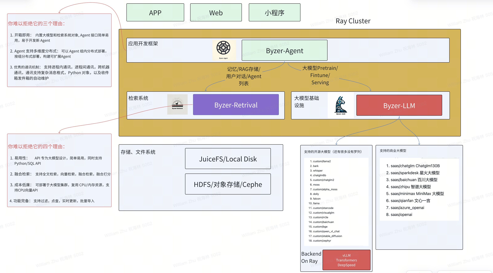
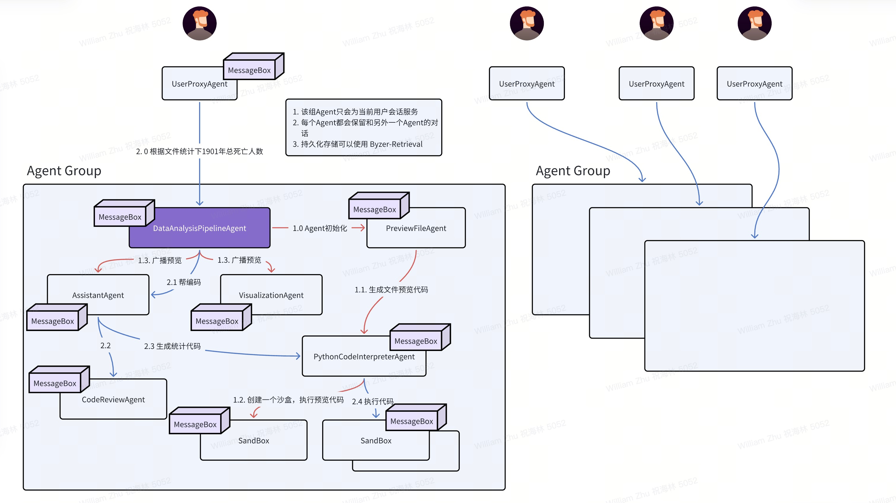

<p align="center">
   <picture>    
    
  </picture>
</p>

<h3 align="center">
Easy, fast, and distributed agent framework for everyone
</h3>

<p align="center">
| <a href="#"><b>Documentation</b></a> | <a href="#"><b>Blog</b></a> | | <a href="#"><b>Discord</b></a> |

</p>

---

*Latest News* 🔥

- [2024/03] Byzer-Agent released in Byzer-LLM 0.1.44

---

Byzer-Agent is an distributed agent framework for LLM. It is designed to be easy to use, easy to scale, and easy to debug. It is built on top of Ray, developed from [autogen](https://github.com/microsoft/autogen)。

The code of Byzer-Agent is under the project [Byzer-LLM](https://github.com/allwefantasy/byzer-llm). So this project is just a document project.

Notice that Byzer-Agent is just a framework, you can use it to build your own agents, and we will take care of the communication(local/remote), keep the conversation history, and so on.

In order to implement a real business job, you can use Langchain / LlamaIndex in Byzer-Agent since they are a good library which impelement a lot of useful functions.

---

* [Installation](#installation)
* [Architecture](#Architecture)
* [DataAnalysis (multi-agent)](#DataAnalysis-(multi-agent))
* [Quick Start](#quick-start)

## Architecture

<p align="center">
  
</p>

---


##  Installation

Install the following projects step by step.

1. [Byzer-LLM](https://github.com/allwefantasy/byzer-llm) 
2. [Byzer-Retrieval](https://github.com/allwefantasy/byzer-retrieval) (Optional)

---

## DataAnalysis (multi-agent)

<p align="center">
  
</p>

---

## Quick Start

Here we will show you how to build a simple agent using Byzer-Agent.
Below is a simple implementation of a HelloWorld Agent:

```python
from byzerllm.apps.agent.conversable_agent import ConversableAgent
from typing import Any, Callable, Dict, List, Optional, Tuple, Type, Union
from byzerllm.utils.client import ByzerLLM
from byzerllm.utils.retrieval import ByzerRetrieval
from byzerllm.apps.agent import Agent
from ray.util.client.common import ClientActorHandle, ClientObjectRef
import byzerllm

class HelloWorldAgent(ConversableAgent):    
    
    @byzerllm.prompt()
    def agent_prompt(self)->str:
        '''
        你是一个简单的问候Agent,无论用户说什么,你都回复 "Hello, world!"
        '''
    
    def __init__(
        self,
        name: str,
        llm: ByzerLLM,
        retrieval: ByzerRetrieval,
        system_message: Optional[str] = None,        
        is_termination_msg: Optional[Callable[[Dict], bool]] = None,
        max_consecutive_auto_reply: Optional[int] = None,
        human_input_mode: Optional[str] = "NEVER",
        **kwargs,
    ):  
        system_message = self.agent_prompt()      
        super().__init__(
            name,
            llm,retrieval,
            system_message,
            is_termination_msg,
            max_consecutive_auto_reply,
            human_input_mode,
            **kwargs,
        )
                
    @byzerllm.agent_reply()
    def say_hello(
        self,
        raw_message: Optional[Union[Dict,str]] = None,
        messages: Optional[List[Dict]] = None,
        sender: Optional[Union[ClientActorHandle,Agent,str]] = None,
        config: Optional[Any] = None,
    ) -> Tuple[bool, Union[str, Dict, None]]:          
        return True, {"content":"Hello, world!","metadata":{}}
```

The implementation of this HelloWorldAgent is very simple:

1. We defined a class called HelloWorldAgent, which inherits from the ConversableAgent base class.
2. Above the class definition, we use the @byzerllm.prompt() decorator to define the Agent's system message prompt to guide the 34. Agent's behavior. In this example, we instruct the Agent to reply "Hello, world!" regardless of the message received.
3. In the __init__ method, we call the superclass constructor, passing in the necessary parameters.
4. We defined a method called say_hello and used the @byzerllm.agent_reply() decorator to mark it as a reply function. In this method, we directly return a tuple, the first element being True, indicating this is a terminating reply, and the second element is a dictionary containing the reply content "Hello, world!" and an empty metadata dictionary.

Example code using this HelloWorldAgent is as follows:

```python
import byzerllm
byzerllm.connect_cluster()
llm = byzerllm.ByzerLLM()
llm.setup_template(model="sparkdesk_chat", template="auto")
llm.setup_default_model_name("sparkdesk_chat")

from byzerllm.apps.agent.user_proxy_agent import UserProxyAgent

hello_agent = HelloWorldAgent("hello_agent", llm=llm, retrieval=None)
user = UserProxyAgent("user", llm=llm, retrieval=None, human_input_mode="NEVER",max_consecutive_auto_reply=0)

user.initiate_chat(
    recipient=hello_agent, clear_history=True, message={
        "content":"Hello there, may I ask who you are?"        
    },
)
```

In this example, we created an instance of HelloWorldAgent and an instance of UserProxyAgent. Then, we have the user agent send a message "Hello there, may I ask who you are?" to the hello_agent. Upon receiving the message, hello_agent will reply with "Hello, world!" according to our defined say_hello reply function.

That's a simple implementation and usage example of a HelloWorld Agent. You can extend this base to add more reply functions and logic according to your needs."


## Advanced Usage

## 1. Agent Communication

Byzer-Agent provides a simple and easy-to-use communication mechanism for agents. You can use the following methods to communicate with other agents:

* initiate_chat
* send

The initiate_chat method is used to start a conversation in client side.. You can specify the recipient agent, the message to send, and other parameters. 

The send method is used to agent to agent communication. 

Here is an example of how to use send method:

```python
from byzerllm.apps.agent.conversable_agent import ConversableAgent
from typing import Any, Callable, Dict, List, Optional, Tuple, Type, Union
from byzerllm.utils.client import ByzerLLM
from byzerllm.utils.retrieval import ByzerRetrieval
from byzerllm.apps.agent import Agent,ChatResponse,get_agent_name
from ray.util.client.common import ClientActorHandle, ClientObjectRef
import byzerllm

class AgentA(ConversableAgent):    
    
    @byzerllm.prompt()
    def agent_prompt(self)->str:
        '''
        你是一个友善的Agent,你的名字叫Alice。
        当有人问你 "你是谁?" 的时候,你会回答 "我是Alice,很高兴认识你!"
        然后你会将收到的消息转发给你的好友Bob。
        '''
    
    def __init__(
        self,
        name: str,
        llm: ByzerLLM,
        retrieval: ByzerRetrieval,
        bob: Union[Agent, ClientActorHandle,str],
        system_message: Optional[str] = None,      
        is_termination_msg: Optional[Callable[[Dict], bool]] = None,
        max_consecutive_auto_reply: Optional[int] = None,
        human_input_mode: Optional[str] = "NEVER",
        **kwargs,
    ):     
        system_message = self.agent_prompt()   
        super().__init__(
            name,
            llm,retrieval,
            system_message,
            is_termination_msg,
            max_consecutive_auto_reply,
            human_input_mode,
            **kwargs,
        )
        self.bob = bob      

    ## this function will reply to all agents(wihout agent filter), so it should be put at the head of the class
    ## to make sure the other reply functions execute before this function. Otherwise, the other reply 
    ## functions will not be executed.
    @byzerllm.agent_reply()
    def introduce_self(
        self,
        raw_message: Optional[Union[Dict,str,ChatResponse]] = None,
        messages: Optional[List[Dict]] = None,
        sender: Optional[Union[ClientActorHandle,Agent,str]] = None,
        config: Optional[Any] = None,
    ) -> Tuple[bool, Union[str, Dict, None,ChatResponse]]:  
        # forward the message to bob
        self.send(raw_message, self.bob)
        # get the last message from bob
        # _messages is a dictionary with agent names as keys and a list of messages as values
        # you can use the get_agent_name function to get the name of an agent
        message = self._messages[get_agent_name(self.bob)][-1]
        return True, None

    @byzerllm.agent_reply(lambda self:[self.bob])
    def reply_bob(
        self,
        raw_message: Optional[Union[Dict,str,ChatResponse]] = None,
        messages: Optional[List[Dict]] = None,
        sender: Optional[Union[ClientActorHandle,Agent,str]] = None,
        config: Optional[Any] = None,
    ) -> Tuple[bool, Union[str, Dict, None,ChatResponse]]:  
        # we don't want to reply to bob                    
        return True, None      
    
        

class AgentB(ConversableAgent):    
    
    @byzerllm.prompt()
    def agent_prompt(self)->str:
        '''
        你是一个友善的Agent,你的名字叫Bob。
        当有人问 "你是谁?" 的时候,你会回答 "我是Bob,Alice的好朋友,很高兴认识你!"
        '''
    
    def __init__(
        self,
        name: str,
        llm: ByzerLLM,
        retrieval: ByzerRetrieval,
        system_message: Optional[str] = None,        
        is_termination_msg: Optional[Callable[[Dict], bool]] = None,
        max_consecutive_auto_reply: Optional[int] = None,
        human_input_mode: Optional[str] = "NEVER",
        **kwargs,
    ):     
        system_message = self.agent_prompt()   
        super().__init__(
            name,
            llm,retrieval,
            system_message,
            is_termination_msg,
            max_consecutive_auto_reply,
            human_input_mode,
            **kwargs,
        )
                
    @byzerllm.agent_reply()
    def introduce_self(
        self,
        raw_message: Optional[Union[Dict,str,ChatResponse]] = None,
        messages: Optional[List[Dict]] = None,
        sender: Optional[Union[ClientActorHandle,Agent,str]] = None,
        config: Optional[Any] = None,
    ) -> Tuple[bool, Union[str, Dict, None,ChatResponse]]:  
        return True, {"content":"我是Bob,Alice的好朋友,很高兴认识你!","metadata":{}}


```
We have two agents, AgentA and AgentB. AgentA will forward the message to AgentB and then reply to the user with the last message from AgentB.

```python
import byzerllm
byzerllm.connect_cluster()
llm = byzerllm.ByzerLLM()
llm.setup_template(model="sparkdesk_chat",template="auto")
llm.setup_default_model_name("sparkdesk_chat")

from byzerllm.apps.agent.user_proxy_agent import UserProxyAgent

bob = AgentB("bob",llm=llm,retrieval=None)
alice = AgentA("alice",llm=llm,retrieval=None,bob=bob)
user = UserProxyAgent("user",llm=llm,retrieval=None,human_input_mode="NEVER",max_consecutive_auto_reply=0)

user.initiate_chat(
    recipient=alice,clear_history=True,message={
        "content":"你是谁?"        
    },
)


```

Here we have two agents, AgentA and AgentB. AgentA will forward the message to AgentB and then reply to the user with the last message from AgentB.

The output of the above code will be:

```
user (to alice):

你是谁?

--------------------------------------------------------------------------------
alice (to bob):

你是谁?

--------------------------------------------------------------------------------
bob (to alice):

我是Bob,Alice的好朋友,很高兴认识你!
```

### 1.1 Agent Reply Function Order

The order in which the reply functions are executed is determined by the order in which they are defined in the agent class. 

The reply functions are executed in the order of their definition, If the function finds that the message is not for it, it can return False, and the next function will be executed.

So you need to put the reply function which can reply all agents at the head of the class.

## 2. Agent State

In the provided code, state management is handled through the following mechanisms:

1. Message History:
   - The `ConversableAgent` class maintains a dictionary called `_messages` which stores the conversation history for each agent. The keys of the dictionary are the agent names (obtained using the `get_agent_name` function), and the values are lists of messages exchanged with each agent.
   - When an agent receives a message, it appends the message to the corresponding list in the `_messages` dictionary using the `_append_message` method.
   - The conversation history can be accessed using the `chat_messages` property or the `get_chat_messages` method.
   - The `last_message` method allows retrieving the last message exchanged with a specific agent.

2. Agent References:
   - In the example code, `AgentA` is initialized with a reference to `AgentB` through the `bob` parameter in its constructor. This allows `AgentA` to send messages directly to `AgentB` using the `send` method.
   - By storing references to other agents, an agent can maintain a state of its connections and communicate with them as needed.

3. Agent-specific Variables:
   - Each agent class can define its own instance variables to store agent-specific state information.
   - For example, `AgentA` has an instance variable `self.bob` which stores the reference to `AgentB`. This variable can be used to keep track of the connected agent and perform actions based on that information.

4. Reply Functions:
   - The `@byzerllm.agent_reply()` decorator is used to define reply functions within an agent class. These functions are triggered when the agent receives a message from a specific sender or any sender (if no sender is specified).
   - Reply functions can access the agent's state, such as the conversation history (`_messages`) and agent-specific variables, to make decisions and generate responses based on the current state.

5. Conversation Termination:
   - The `is_termination_msg` parameter in the agent constructor allows specifying a function that determines if a received message should terminate the conversation.
   - By setting `max_consecutive_auto_reply` to 0 for the `UserProxyAgent`, it prevents the agent from engaging in further automatic replies after receiving a response from `AgentA`.
   - The `reply_bob` function in `AgentA` is decorated with `@byzerllm.agent_reply(lambda self:[self.bob])` to handle messages from `AgentB` and terminate the conversation without sending a reply back to `AgentB`.

These mechanisms collectively enable state management in the agent-based conversation system. The conversation history, agent references, and agent-specific variables allow agents to maintain and access relevant state information. The reply functions and conversation termination conditions provide control over the flow of the conversation based on the current state.


## 3. Remote Agent

You can slightly modify the previous example to use remote agents. Here is an example of how to use remote agents:

```python
from byzerllm.apps.agent.conversable_agent import ConversableAgent
from typing import Any, Callable, Dict, List, Optional, Tuple, Type, Union
from byzerllm.utils.client import ByzerLLM
from byzerllm.utils.retrieval import ByzerRetrieval
from byzerllm.apps.agent import Agents,Agent,ChatResponse,get_agent_name
from ray.util.client.common import ClientActorHandle, ClientObjectRef
import byzerllm

class AgentA(ConversableAgent):    
    
    @byzerllm.prompt()    
    def agent_prompt(self)->str:
        '''
        你是一个友善的Agent,你的名字叫Alice。
        当有人问你 "你是谁?" 的时候,你会回答 "我是Alice,很高兴认识你!"
        然后你会将收到的消息转发给你的好友Bob。
        '''
    
    def __init__(
        self,
        name: str,
        llm: ByzerLLM,
        retrieval: ByzerRetrieval,
        bob: Union[Agent, ClientActorHandle,str],
        system_message: Optional[str] = None,        
        is_termination_msg: Optional[Callable[[Dict], bool]] = None,
        max_consecutive_auto_reply: Optional[int] = None,
        human_input_mode: Optional[str] = "NEVER",
        **kwargs,
    ):        
        system_message = self.agent_prompt()
        super().__init__(
            name,
            llm,retrieval,
            system_message,
            is_termination_msg,
            max_consecutive_auto_reply,
            human_input_mode,
            **kwargs,
        )
        self.bob = bob

    @byzerllm.agent_reply()
    def introduce_self(
        self,
        raw_message: Optional[Union[Dict,str,ChatResponse]] = None,
        messages: Optional[List[Dict]] = None,
        sender: Optional[Union[ClientActorHandle,Agent,str]] = None,
        config: Optional[Any] = None,
    ) -> Tuple[bool, Union[str, Dict, None,ChatResponse]]:  
        # forward the message to bob
        self.send(raw_message, self.bob)
        # get the last message from bob
        # _messages is a dictionary with agent names as keys and a list of messages as values
        # you can use the get_agent_name function to get the name of an agent
        message = self._messages[get_agent_name(self.bob)][-1]
        return True, None    

    @byzerllm.agent_reply(lambda self:[self.bob])
    def reply_bob(
        self,
        raw_message: Optional[Union[Dict,str,ChatResponse]] = None,
        messages: Optional[List[Dict]] = None,
        sender: Optional[Union[ClientActorHandle,Agent,str]] = None,
        config: Optional[Any] = None,
    ) -> Tuple[bool, Union[str, Dict, None,ChatResponse]]:  
        # we don't want to reply to bob                    
        return True, None    
                
        

class AgentB(ConversableAgent):    
    
    @byzerllm.prompt()    
    def agent_prompt(self)->str:
        '''
        你是一个友善的Agent,你的名字叫Bob。
        当有人问 "你是谁?" 的时候,你会回答 "我是Bob,Alice的好朋友,很高兴认识你!"
        '''
    
    def __init__(
        self,
        name: str,
        llm: ByzerLLM,
        retrieval: ByzerRetrieval,
        system_message: Optional[str] = None,        
        is_termination_msg: Optional[Callable[[Dict], bool]] = None,
        max_consecutive_auto_reply: Optional[int] = None,
        human_input_mode: Optional[str] = "NEVER",
        **kwargs,
    ):    
        system_message = self.agent_prompt()    
        super().__init__(
            name,
            llm,retrieval,
            system_message,
            is_termination_msg,
            max_consecutive_auto_reply,
            human_input_mode,
            **kwargs,
        )
                
    @byzerllm.agent_reply()
    def introduce_self(
        self,
        raw_message: Optional[Union[Dict,str,ChatResponse]] = None,
        messages: Optional[List[Dict]] = None,
        sender: Optional[Union[ClientActorHandle,Agent,str]] = None,
        config: Optional[Any] = None,
    ) -> Tuple[bool, Union[str, Dict, None,ChatResponse]]:  
        return True, {"content":"我是Bob,Alice的好朋友,很高兴认识你!","metadata":{}}

import byzerllm
byzerllm.connect_cluster()
llm = byzerllm.ByzerLLM()
llm.setup_template(model="sparkdesk_chat",template="auto")
llm.setup_default_model_name("sparkdesk_chat")

from byzerllm.apps.agent.user_proxy_agent import UserProxyAgent

bob = Agents.create_remote_agent(AgentB,"bob",llm,None)

alice = Agents.create_remote_agent(AgentA,"alice",llm,None,bob=bob)

user = UserProxyAgent("user",llm=llm,retrieval=None,human_input_mode="NEVER",max_consecutive_auto_reply=0)

user.initiate_chat(
    recipient=alice,clear_history=True,message={
        "content":"你是谁?"        
    },
)

```

Here is the output of the above code:

```
(AgentB pid=935730) alice (to bob):
(AgentB pid=935730) 
(AgentB pid=935730) 你是谁?
(AgentB pid=935730) 
(AgentB pid=935730) --------------------------------------------------------------------------------
(AgentA pid=935731) user (to alice):
(AgentA pid=935731) bob (to alice):
(AgentA pid=935731) 我是Bob,Alice的好朋友,很高兴认识你!
```


## 4. Agent Termination

If you want to terminate the conversation between two agents, you have the following options:

1. set the `max_consecutive_auto_reply` to 0 when you create agent. it prevents the agent from engaging in further automatic replies after receiving a response from Other agent.

2. Return False/True,None in the reply function, the None will stop sending the message to the other agent.

3. return False/True,{"content":"xxx",{"metadata":{"TERMINATE":True}}, the metadata will indicate the other agent that do not reply to this message.

Please take care of the termination of the conversation, otherwise, the conversation will never stop.


