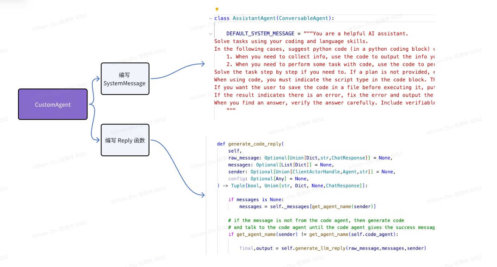

<p align="center">
  BYZER-AGENT
</p>

<h3 align="center">
Easy, fast, and cheap agent framework for everyone
</h3>

<p align="center">
| <a href="#"><b>Documentation</b></a> | <a href="#"><b>Blog</b></a> | | <a href="#"><b>Discord</b></a> |

</p>

---

*Latest News* 🔥

- [2023/12] Byzer-Agent released in Byzer-LLM 0.1.19

---

Byzer-Agent is an agent framework for LLM. It is designed to be easy to use, easy to scale, and easy to debug. It is built on top of Ray, a high-performance distributed execution framework.

The code of Byzer-Agent is under the project [Byzer-LLM](https://github.com/allwefantasy/byzer-llm). So this project is just a document project.

---

## Architecture

<p align="center">
  
</p>

---

## DataAnalysis (multi-agent)

<p align="center">
  
</p>

---

## RAG Example

Please install the following projects first:

1. [Byzer-LLM](https://github.com/allwefantasy/byzer-llm), 
2. [Byzer-Retrieval](https://github.com/allwefantasy/byzer-retrieval)


Here is the example code:

```python
user.initiate_chat(
retrieval_agent,
message={
    "content":"介绍下 Gluten",
    "metadata":{
        "file_path":"/home/byzerllm/projects/jupyter-workspace/aritcle.txt"
    }
},)

```

The output:

```
user (to retrieval_agent):

介绍下 Gluten

--------------------------------------------------------------------------------
retrieval_agent (to user):

 Gluten 是一个开源项目，其目标是通过本地化 Spark 项目，以提高 Spark 在 ETL 批处理领域的性能。Gluten 项目由深耕于 Spark 加速的 Intel OAP 团队和 Kyligence 公司共建，BIGO 大数据团队于 2022 年 9 月加入研发。Gluten 项目的核心思想是使用本地的 Native 运行时库作为 Spark 插件，结合了 Spark 的可扩展性框架、优化器、容错能力和 Native 执行库的高性能，预期可以带来数倍的性能提升。

Gluten 项目主要支持 Velox 和 ClickHouse 两种 Native 执行库。Velox 是 Meta 开源的本地执行库，其目标是构建统一的查询执行层，提供了数据类型、向量数据结构、Pipeline 框架、算子、表达式计算、IO 和资源管理等功能。而 ClickHouse 是 2016 年 Yandex 公司开源的一种用于联机分析(OLAP)的列式数据库，以其高性能近年来备受关注。

BIGO 大数据团队在 2022 年 9 月加入 Gluten 项目后，已经在生产环境逐步灰度 Gluten，开始替换 Spark 的 ETL 工作负载，目前灰度 SQL 上获得了总体 40%+ 的成本节省。

```

The code of this example is [here](./notebooks/quick_rag.ipynb).

---

## DataAnalysis

1. Create a DataAnalysis agent group


```python
from byzerllm.apps.agent import Agents
from byzerllm.apps.agent.user_proxy_agent import UserProxyAgent
from byzerllm.apps.agent.extensions.data_analysis import DataAnalysis


user = Agents.create_local_agent(UserProxyAgent,"user",llm,retrieval,
                                human_input_mode="NEVER",
                                max_consecutive_auto_reply=0)

data_analysis = DataAnalysis("chat4","william","/home/byzerllm/projects/jupyter-workspace/test.csv",
                             llm,retrieval)


```

2. Chat

```python
data_analysis.analyze("根据年份按 Deaths 绘制一个折线图")
```

3. Output

```python
o = data_analysis.output()
show_image(o["content"])
```

## Custom Agent

How to create a custom agent?

<p align="center">
  
</p>


